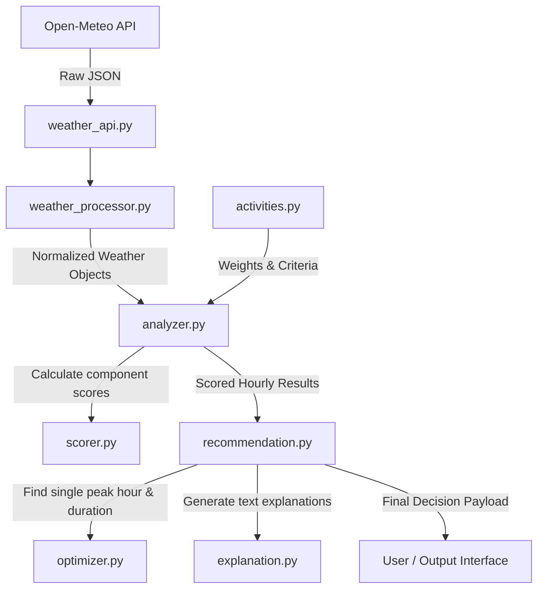

# WeatherGPT — Project File Structure & Explanation

This document provides a comprehensive overview of all files and directories in the **WeatherGPT** codebase, explaining their purpose, functionality, and how they fit into the overall decision intelligence architecture.

---

## 📁 Repository Overview

```
WeatherGPT/
│
├── README.md                          # Project overview and high-level introduction
├── .gitignore                         # Git ignore configurations (Python cache, venv, IDE files)
├── PROJECT_STRUCTURE.md              # Detailed documentation of all project files and their duties
│
├── backend/                           # Core backend modules for weather fetching & decision logic
│   ├── weather_api.py                 # Fetches forecast data from Open-Meteo REST API
│   ├── weather_processor.py           # Normalizes and formats raw hourly API responses
│   └── decision_engine/               # Activity scoring, optimization & decision engine
│       ├── __init__.py                # Package initialization marker
│       ├── activities.py              # Configuration & rule definitions for supported activities
│       ├── rules.py                   # Legacy rules configuration & helper functions
│       ├── scorer.py                  # Multi-factor weather scoring & risk assessment logic
│       ├── analyzer.py                # Daily weather analysis & time window filtering
│       ├── optimizer.py               # Optimization algorithms (best single hour & continuous window)
│       ├── explanation.py             # Human-readable reasoning generation for recommendations
│       └── recommendation.py          # High-level aggregator producing final decision payload
│
└── tests/                             # Unit tests & end-to-end integration tests
    ├── test_weather_api.py            # Tests live fetching from Open-Meteo API
    ├── test_weather_processor.py      # Standalone test/script for data processing logic
    ├── test_engine.py                 # Tests decision engine scoring, optimizer, & explanation on mock data
    └── test_real_decision.py          # End-to-end test fetching live weather and producing recommendations
```

---

## 📑 Detailed File Explanations

### 🏠 Root Directory Files

#### 1. [`README.md`](file:///c:/Shrish%20Kumar%20Saini/Amity%20University/Sem5/SIH/WeatherGPT/README.md)
* **Purpose:** Primary project readme file.
* **Description:** Contains high-level project summary identifying WeatherGPT as an AI-powered weather decision intelligence platform for Smart India Hackathon (SIH).

#### 2. [`.gitignore`](file:///c:/Shrish%20Kumar%20Saini/Amity%20University/Sem5/SIH/WeatherGPT/.gitignore)
* **Purpose:** Specifies intentionally untracked files that Git should ignore.
* **Description:** Excludes Python standard compiled files (`__pycache__/`, `*.pyc`), virtual environments (`.venv/`, `env/`), IDE settings (`.vscode/`, `.idea/`), log files, and OS artifacts.

#### 3. [`PROJECT_STRUCTURE.md`](file:///c:/Shrish%20Kumar%20Saini/Amity%20University/Sem5/SIH/WeatherGPT/PROJECT_STRUCTURE.md)
* **Purpose:** Technical documentation for repository structure and module capabilities.
* **Description:** This file itself—explains what every file does and how components interact.

---

### ⚙️ Backend Module (`backend/`)

#### 4. [`backend/weather_api.py`](file:///c:/Shrish%20Kumar%20Saini/Amity%20University/Sem5/SIH/WeatherGPT/backend/weather_api.py)
* **Purpose:** External API client for weather forecast data.
* **Description:**
  * Defines `get_weather(latitude, longitude)`.
  * Calls Open-Meteo REST API (`https://api.open-meteo.com/v1/forecast`).
  * Requests hourly parameters: `temperature_2m`, `precipitation_probability`, `wind_speed_10m`, and `relative_humidity_2m`.
  * Returns JSON forecast data.

#### 5. [`backend/weather_processor.py`](file:///c:/Shrish%20Kumar%20Saini/Amity%20University/Sem5/SIH/WeatherGPT/backend/weather_processor.py)
* **Purpose:** Data transformation and normalization layer.
* **Description:**
  * Defines `process_weather(weather_data)`.
  * Parses raw Open-Meteo array structure into clean, dictionary-based list of hourly objects.
  * Formats ISO timestamps into readable date (`YYYY-MM-DD`) and time (`HH:MM`).

---

### 🧠 Decision Engine Submodule (`backend/decision_engine/`)

#### 6. [`backend/decision_engine/__init__.py`](file:///c:/Shrish%20Kumar%20Saini/Amity%20University/Sem5/SIH/WeatherGPT/backend/decision_engine/__init__.py)
* **Purpose:** Python package marker.
* **Description:** Enables `decision_engine` directory to be imported as a Python module.

#### 7. [`backend/decision_engine/activities.py`](file:///c:/Shrish%20Kumar%20Saini/Amity%20University/Sem5/SIH/WeatherGPT/backend/decision_engine/activities.py)
* **Purpose:** Configuration repository for domain-specific activity thresholds and constraints.
* **Description:** Defines `ACTIVITIES` dictionary containing parameters for supported activities:
  * **`spraying` (Crop Spraying):** Temperature range 18–30°C, max wind 15 km/h, max rain prob 30%, humidity 40–80%, score threshold 80, time 06:00–18:00.
  * **`running` (Outdoor Running):** Temperature range 10–25°C, max wind 25 km/h, max rain prob 50%, humidity 30–80%, score threshold 70, time 05:00–21:00.
  * **`outdoor_event` (Outdoor Events):** Temperature range 15–30°C, max wind 25 km/h, max rain prob 30%, humidity 30–80%, score threshold 70, time 07:00–22:00.

#### 8. [`backend/decision_engine/scorer.py`](file:///c:/Shrish%20Kumar%20Saini/Amity%20University/Sem5/SIH/WeatherGPT/backend/decision_engine/scorer.py)
* **Purpose:** Mathematical evaluation engine for weather safety and suitability.
* **Description:**
  * Implements component rating functions (0 to 100): `check_temperature`, `check_rain`, `check_wind`, `check_humidity`.
  * `calculate_score(weather, weights, rules)`: Computes weighted suitability score (0–100).
  * `get_risk(score)`: Classifies risk level into `"LOW"` (score ≥ 80), `"MEDIUM"` (60 ≤ score < 80), or `"HIGH"` (score < 60).

#### 9. [`backend/decision_engine/rules.py`](file:///c:/Shrish%20Kumar%20Saini/Amity%20University/Sem5/SIH/WeatherGPT/backend/decision_engine/rules.py)
* **Purpose:** Legacy rule definitions and basic evaluation helpers.
* **Description:** Contains `SPRAYING_RULES` config and standalone `check_humidity` binary function.

#### 10. [`backend/decision_engine/analyzer.py`](file:///c:/Shrish%20Kumar%20Saini/Amity%20University/Sem5/SIH/WeatherGPT/backend/decision_engine/analyzer.py)
* **Purpose:** Day-level analysis orchestrator.
* **Description:**
  * Defines `analyze_day(weather_data, target_date, activity="spraying")`.
  * Filters processed weather list by specific date and activity-allowed operating hours.
  * Runs each eligible hour through `calculate_score` and `get_risk`.

#### 11. [`backend/decision_engine/optimizer.py`](file:///c:/Shrish%20Kumar%20Saini/Amity%20University/Sem5/SIH/WeatherGPT/backend/decision_engine/optimizer.py)
* **Purpose:** Optimization algorithms for time window selection.
* **Description:**
  * `find_best_hour(results)`: Finds single hour with highest suitability score.
  * `find_best_window(results, minimum_score, minimum_duration)`: Identifies contiguous block of hours meeting minimum score criteria and returns start/end times, duration, and average score.
  * `choose_better_window(...)`: Helper for comparing window candidates.

#### 12. [`backend/decision_engine/explanation.py`](file:///c:/Shrish%20Kumar%20Saini/Amity%20University/Sem5/SIH/WeatherGPT/backend/decision_engine/explanation.py)
* **Purpose:** Natural language explanation generator.
* **Description:**
  * Defines `generate_reasons(weather, activity="spraying")`.
  * Evaluates weather variables against activity thresholds to produce bullet points explaining why conditions are favorable or unfavorable.

#### 13. [`backend/decision_engine/recommendation.py`](file:///c:/Shrish%20Kumar%20Saini/Amity%20University/Sem5/SIH/WeatherGPT/backend/decision_engine/recommendation.py)
* **Purpose:** Final decision aggregator.
* **Description:**
  * Defines `generate_recommendation(results, activity="spraying")`.
  * Combines `find_best_hour`, `find_best_window`, and `generate_reasons` into a single structured recommendation payload.

---

### 🧪 Test Suite (`tests/`)

#### 14. [`tests/test_weather_api.py`](file:///c:/Shrish%20Kumar%20Saini/Amity%20University/Sem5/SIH/WeatherGPT/tests/test_weather_api.py)
* **Purpose:** Simple verification script for API fetcher.
* **Description:** Calls `get_weather(28.67, 77.43)` for test coordinates and prints raw response.

#### 15. [`tests/test_weather_processor.py`](file:///c:/Shrish%20Kumar%20Saini/Amity%20University/Sem5/SIH/WeatherGPT/tests/test_weather_processor.py)
* **Purpose:** Verification script for processor transformation.
* **Description:** Contains inline copy of processor function used for standalone verification.

#### 16. [`tests/test_engine.py`](file:///c:/Shrish%20Kumar%20Saini/Amity%20University/Sem5/SIH/WeatherGPT/tests/test_engine.py)
* **Purpose:** Unit test script for decision engine components on synthetic mock data.
* **Description:** Feeds sample hourly data to scorer, optimizer, and explanation generator, printing suitability scores, best window, and reasoning text.

#### 17. [`tests/test_real_decision.py`](file:///c:/Shrish%20Kumar%20Saini/Amity%20University/Sem5/SIH/WeatherGPT/tests/test_real_decision.py)
* **Purpose:** Full end-to-end integration test.
* **Description:**
  1. Fetches real live weather data for Ghaziabad (lat: `28.646748`, lon: `77.48004`).
  2. Processes raw JSON into structured hourly data.
  3. Analyzes tomorrow's forecast for crop spraying.
  4. Generates and displays full decision recommendation report.

---

## 🔄 End-to-End Execution Flow


